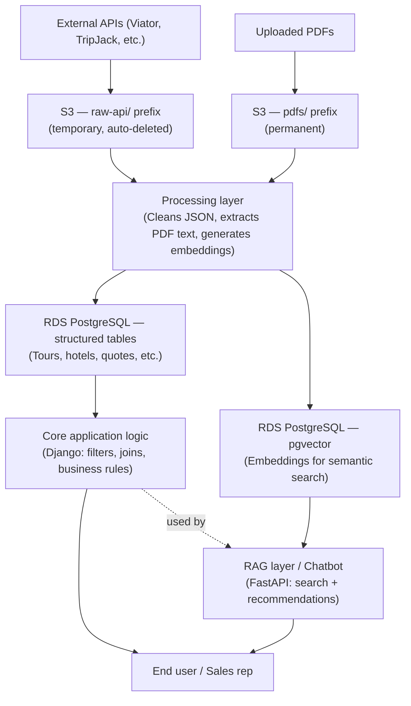

# TripStore Architecture

Welcome to the TripStore documentation repository. This repository outlines the architecture, design decisions, and upgrade path from our legacy system (Google Apps Script + Sheets) to a robust, scalable backend.

## 1. High-Level Architecture

The core of our new system is designed to seamlessly process raw data (APIs, PDFs) into structured data, enabling both traditional application logic and advanced AI/chatbot search capabilities on a single source of truth.

### The Data Flow Principles
1. **Raw Landing Zone (S3):** All incoming data lands here first. API dumps are transient, while PDFs are permanent object storage.
2. **Processing Layer:** Custom background code (EC2/Container/Lambda) cleans data, extracts text, and writes into the database.
3. **Structured & Queryable (PostgreSQL):** One instance holds both the standard relational tables and the `pgvector` search index. Two access patterns, one database.
4. **No Direct DB Access for AI:** The chatbot never writes to the database directly and never invents prices. It uses the `core-api` to read state and propose changes.

## 2. Tech Stack

| Component | Technology | Purpose |
|---|---|---|
| **Database** | PostgreSQL | Proper schema, foreign keys, and transactions. Replaces Google Sheets. |
| **Vector Search** | pgvector | Lives inside the same Postgres DB. Used for AI/similarity search. |
| **Main Backend** | Django | Powers `core-api` (catalog, quotes, billing, auth, admin dashboard). |
| **AI / RAG Service** | FastAPI | Powers the `rag-service`. Better suited for async LLM calls. |
| **Background Jobs** | Celery + Redis | Replaces unmonitored triggers. Handles ingestion, PDF generation, etc. |
| **Storage** | S3-compatible | Replaces Google Drive for programmatic file storage. |
| **Deployment** | Docker | Containerized for both local development and production. |

*Note: Adobe PDF Services and Interakt (WhatsApp) remain unchanged from the legacy system.*

## 3. How Services Communicate

- **Synchronous (REST APIs):** If something needs an immediate answer (e.g., pricing a quote, chatbot questions), it happens via standard JSON REST API calls.
- **Asynchronous (Jobs):** If something can happen in the background (e.g., data ingestion, PDF generation), it is queued as a Celery job.
- **API Rules:** All routes are versioned (`/api/v1/...`), resource-based, fully authenticated, and safe to retry.

## 4. Team Ownership and Parallel Work

By moving to separate services with clearly defined API contracts, the team can work in parallel without blocking each other:

- **Mihir (Backend):** `core-api`, `quote-engine`, database structure, API design, deployment.
- **Yash (Frontend):** UI, API integration, routing.
- **Pranav (Data Quality):** Destination/hotel accuracy, deduplication, exports.
- **Yasser (Monitoring):** Django admin setup, Sentry, Flower, daily status reporting.
- **Shreyash (AI & Data Pipelines):** `rag-service`, chatbot, data ingestion validation.

### Day-to-Day Workflow
1. Agree on the API shape first.
2. Build against a placeholder API.
3. Swap to the real implementation once ready.
4. All database changes are reviewed, tracked, and reversible migrations.
