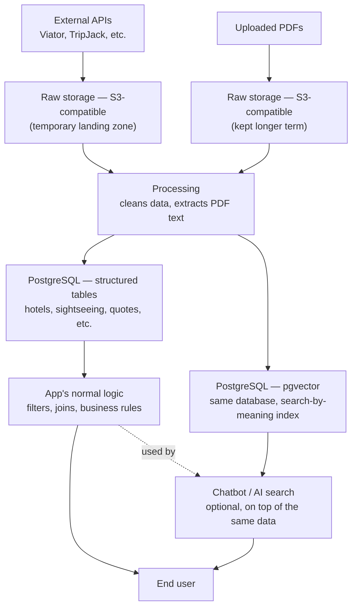
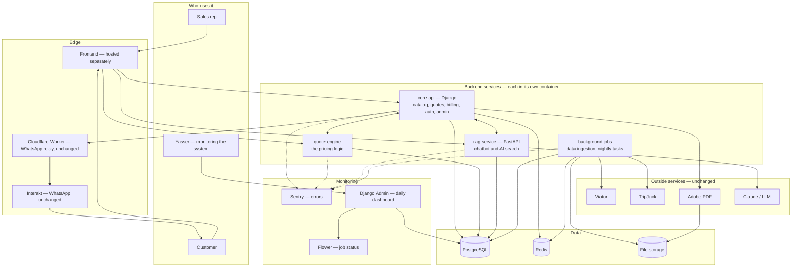
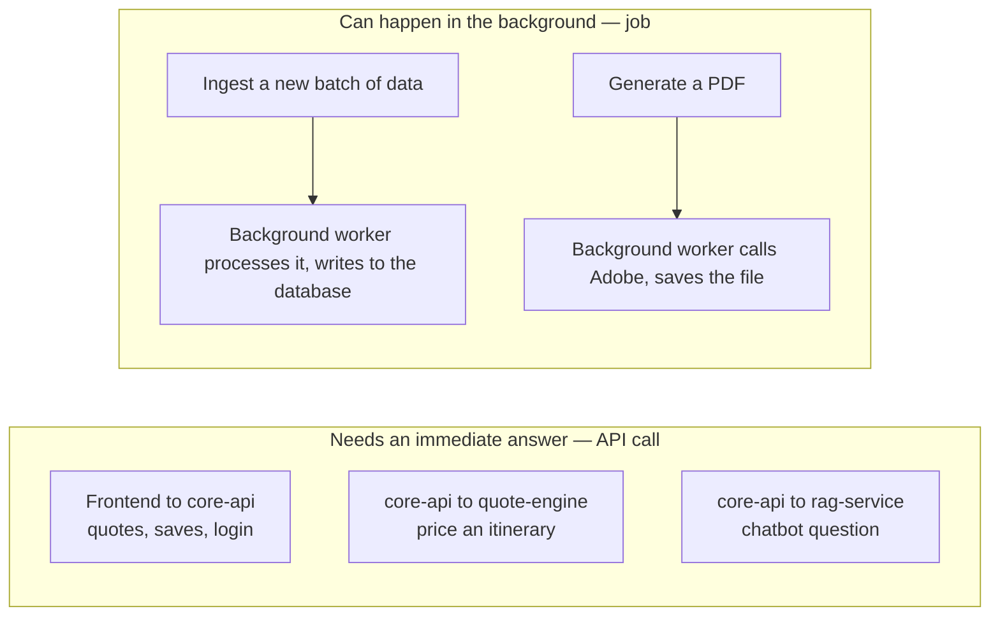
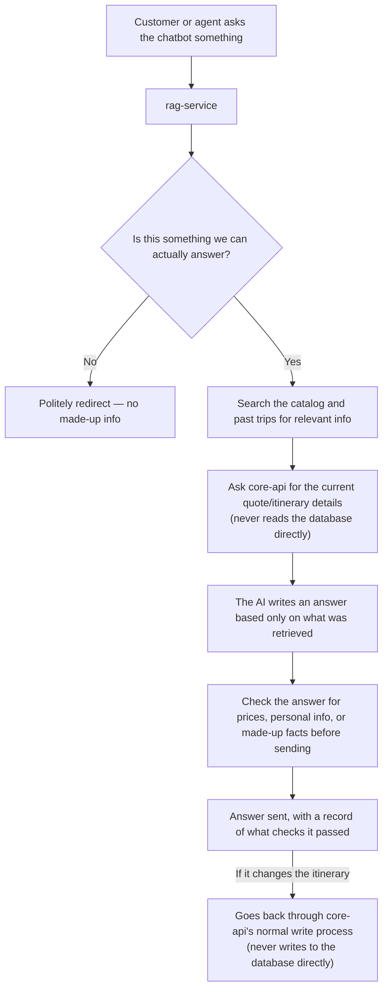
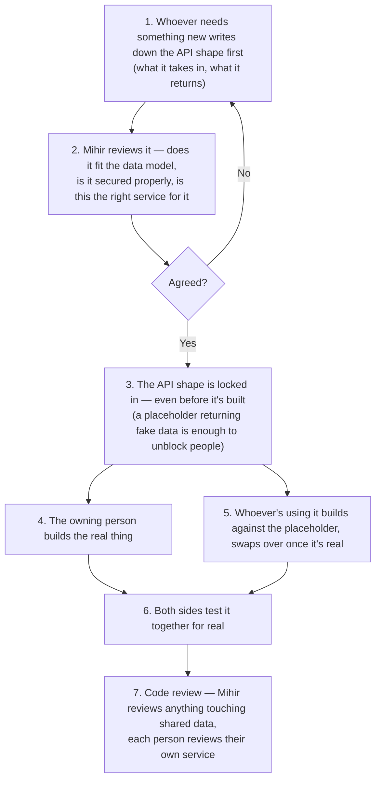
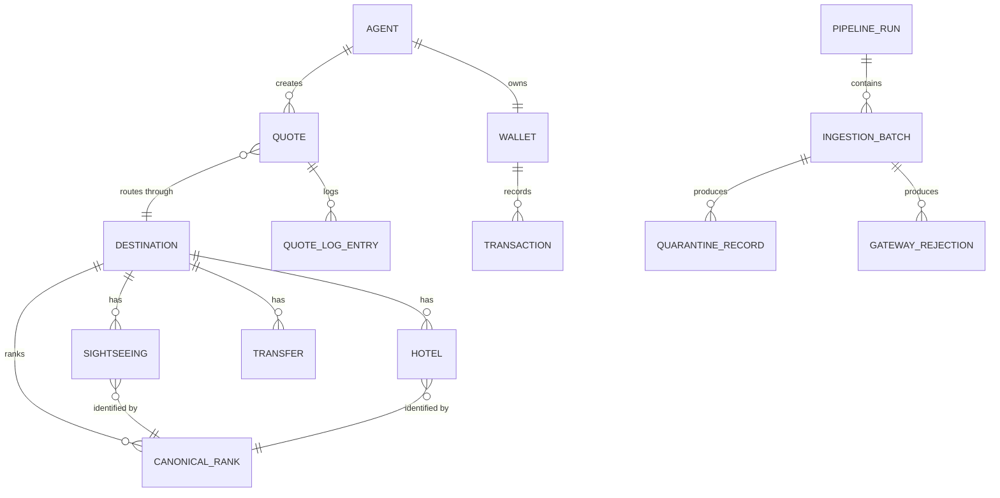
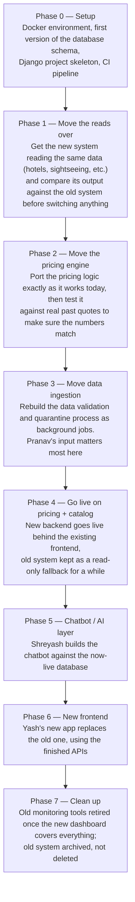

# TripStore — What We're Upgrading To, and Why

Status: approved direction · Owner: Mihir (Backend) · Team: Yash, Pranav, Yasser, Shreyash

This doc covers four things:

1. What we're replacing Google Apps Script + Sheets with, and why we picked each piece of tech.
2. How the different parts of the new system will talk to each other.
3. How we'll monitor the system day-to-day, and why the Django admin panel is central to that.
4. How five people can work on this at the same time without blocking each other.

It doesn't re-explain how the current system works — that's already covered in the old architecture guide. This is just the plan for what we're building next, and the reasoning behind it.

---

## How data storage works, in simple terms

*(September 15, 2026)*

Before getting into the specific stack decisions below, here's the general shape of how data moves through the system — from external sources, into storage, into something an app can actually query.

There are three different jobs, and each one is handled by a different kind of tool because each job has different needs:

1. **Getting raw data in** — pulling data from APIs (Viator, TripJack, etc.) or receiving uploaded files (like PDFs). This data shows up messy and needs somewhere to land before anything is done with it.
2. **Turning it into something usable** — cleaning the raw data, extracting text from PDFs, and preparing it so the app can actually use it.
3. **Storing it in a form the app can query** — once it's clean, it needs to live somewhere the app's normal logic can filter and search it (e.g. "hotels in Rome under a certain price"), and optionally somewhere a chatbot/AI layer can search it by meaning rather than exact filters.

### The pieces involved

| Job | What handles it | What it actually is | Why this one |
|---|---|---|---|
| Landing zone for raw data | **S3-compatible storage** | A place to dump files — no schema, no database rules, just files under a name | Raw API dumps and uploaded PDFs don't need a database yet — they just need somewhere safe to sit before processing |
| Cleaning and processing | **Our own code**, running as a background job or service | Not a storage system — this is the step that takes raw files and turns them into clean, structured data | This is where PDF text gets extracted and raw JSON gets turned into proper rows |
| Structured, queryable data | **PostgreSQL** | A real database — tables, columns, relationships | This is what the app's actual logic queries directly — filters, joins, business rules, the normal way an app looks things up |
| Searching by meaning (optional layer) | **pgvector**, an extension on the same PostgreSQL database | Lets you search by "closest in meaning" instead of exact match | Used only when a chatbot or recommendation feature needs to find things that are conceptually similar, not just an exact filter match |

The important point: **the database is not just there for the chatbot.** The app's normal, everyday logic — searching, filtering, showing results — reads from the same structured tables directly. The AI/chatbot search is an extra layer on top of the same data, not a separate system running alongside it.

### The general flow

### Local development vs. production

We don't need different tools for local development versus the live system — we just run the same tools ourselves instead of using a managed cloud version:

| In production | Locally |
|---|---|
| A managed PostgreSQL database (with pgvector) | The same PostgreSQL, running in Docker on your machine |
| Cloud object storage (S3 or similar) | MinIO in Docker — it speaks the same S3-style API, just running locally |

Because it's the same underlying software either way, none of our code needs to change between local and production — only connection details (like the database address and credentials) change, and those are already meant to live in configuration/environment variables rather than hardcoded in the code.

---

## The stack, and why each piece

| Part | What we have now | What we're moving to | Why |
|---|---|---|---|
| **Database** | Google Sheets — 65 tabs, no schema, no transactions, no real way to stop two things writing at once | **PostgreSQL** | A real database gives us transactions (a write either fully happens or doesn't happen at all — no half-done writes), foreign keys (the database itself stops bad references instead of us checking for them in code), and a real schema (renaming a column can't silently break something else). We also get proper types for prices, cities, and IDs, while still keeping flexible JSON fields where we genuinely need flexibility |
| **Backend framework** | 12 script files sharing one global namespace, everything mixed together — routing, business logic, data access | **Django** for the main app (catalog, quotes, billing, auth, admin) and **FastAPI** for the RAG/chatbot service | Django gives us a proper database toolkit, built-in login/permissions, and — importantly — an admin panel for free, which becomes our main operations dashboard. FastAPI suits the AI/chatbot service better, since that kind of work (calling an LLM, searching a vector index) benefits from being async |
| **Background jobs** | Time-based triggers with no way to check their status from outside the script editor | **Celery + Redis** | Every nightly or scheduled job becomes a task we can see the status of — running, done, failed, retried — instead of guessing whether something actually ran |
| **Caching / sessions / rate limiting** | None right now | **Redis** | Used for three things: caching data we read often so we're not hitting the database every time, limiting how often public endpoints can be called, and storing login sessions properly instead of a hand-rolled token system |
| **How services talk to each other** | One endpoint handling dozens of different actions through a single parameter | **REST APIs**, one per service, each with its own proper authentication | Separate, well-defined endpoints mean each one can be locked down individually, instead of one shared endpoint where it's easy to forget to secure something |
| **Running the app** | Nothing containerized — it just runs inside Google's infrastructure | **Docker**, for both local development and deployment | Once we have several separate services instead of one big script, we need a consistent way to run them. It also means anyone on the team can spin up the whole system locally in one command |
| **File storage** | Google Drive folder | **S3-compatible storage** (AWS S3 or Cloudflare R2) | Drive is fine for humans browsing files, but clunky for a service that needs to fetch or store files programmatically |
| **PDF generation** | Adobe PDF Services | **No change** | Already works well and isn't tied to the old stack — the new backend just calls the same API |
| **WhatsApp delivery** | Interakt + a Cloudflare Worker in front of it | **No change** | Also already working well and fast — nothing to gain by touching it |
| **Frontend** | One large HTML file with everything in it, no build process | **Yash's call** — a proper frontend framework talking to the new APIs | The only thing the backend needs to guarantee is a stable, documented API. What the frontend looks like internally is entirely Yash's decision |
| **RAG / AI search** | A local script doing similarity search in-process | **pgvector** (a search extension on the same Postgres database) to start, moving to a dedicated vector database later only if we actually need to | Keeping it on the same database as everything else means the data the chatbot searches is always the same data that's actually live in the catalog — no separate system that can drift out of sync |
| **Monitoring** | A watcher tool that was built but never actually scheduled to run | **Django admin + Sentry (error tracking) + Flower (job monitor) + centralized logs** | Covered in detail below |

---

## How the pieces fit together

Everything shares one database. Different parts of the system have their own tables, but there's one Postgres instance, so the pricing engine and the chatbot can never end up disagreeing about what's actually in the catalog.

---

## How services talk to each other

The rule is simple: **if something needs an answer right away, it's a normal API call (REST/JSON). If it can run in the background, it's a job (Celery + Redis).** No service ever reaches directly into another service's database tables — everything goes through that service's own API, even internally.

**Why split it this way:** right now, everything is either a synchronous call with a hard time limit, or a background trigger nobody can check the status of. Splitting it this way means slow work — ingesting data, generating a PDF — never blocks anything, and we can always see whether a background job succeeded, failed, or is still running.

### Some basic rules for the APIs

- **Versioned.** Every route lives under `/api/v1/...`. If we ever need a breaking change, it becomes `/api/v2/...` and both run side by side until every caller has switched over.
- **Named after things, not actions.** Instead of one endpoint with dozens of different "action" names, each type of thing — a quote, a destination, a hotel — gets its own clear set of endpoints. This makes it much easier to control who's allowed to do what, since permissions get checked per-resource instead of remembered per-action.
- **Login checked properly, every time, on the server.** Who a user is and what they're allowed to do comes from a verified login token — never from something the client can just claim in a request. This closes off a whole category of "someone pretended to be an admin" bugs.
- **Safe to retry.** Any action that changes something — creating a quote, charging a wallet, generating a PDF — can be retried safely without doing it twice, using a unique key per request.
- **Self-documenting.** The API's documentation is generated straight from the code, so it's never out of date.

### Where the pricing logic lives

The `quote-engine` service owns everything the old pricing engine used to do — budget calculation, hotel/train/sightseeing selection, the whole pricing flow. This logic gets carried over as-is first, not redesigned. If a bug turns up while moving it, we copy the old (buggy) behavior first, get it matching exactly, and only fix the bug afterward as a separate, clearly labeled change. That way we always know whether a difference in output is because we moved something, or because we changed something.

### Where the chatbot / AI layer sits

This is the most important rule for the AI layer: **the chatbot never touches the database directly, and it never invents a price.** Any change it proposes to an itinerary goes through the exact same approval and validation process a human-made change would go through. This isn't optional — it's what stops a made-up price or fact from ever reaching a real customer.

---

## Monitoring — making Django admin the daily dashboard

Right now, there's no easy way to answer basic questions like "did last night's job actually run" without digging through logs by hand. The goal for V3 is that Yasser — or anyone — can answer those questions just by opening the Django admin panel.

### What this actually looks like

| Question | How it's answered |
|---|---|
| "Did last night's ingestion job run, and did it succeed?" | A simple table tracks every job run — status, start/end time, how many records it processed, how many failed. Shows up as a colored status in admin (green/red/yellow), filterable by date |
| "What got rejected, and why?" | Every rejected or quarantined record is stored with its reason, visible and filterable in admin. There's a button to re-queue it once fixed, instead of manually re-entering it somewhere |
| "Are background jobs running right now?" | Flower — a tool built specifically for this — shows every job's status, retries, and which worker is running it. Linked directly from the admin panel |
| "Something broke — what, and where?" | Sentry catches errors from every service automatically and can alert on Slack or email |
| "Give me the whole picture for today, in one place" | A custom admin dashboard page showing today's job runs, rejected records, quote volume, and any alerts — one screen, no digging |

### The underlying principle

A check that can never fail isn't actually checking anything. Every dashboard or status indicator we build should be something we can deliberately break to prove it actually catches problems — not just something that looks reassuring. If we can't think of a way to make the "job succeeded" badge show green while the job actually failed, we haven't really tested it.

---

## How the team works together without blocking each other

**Question: does backend need to be the glue holding everything together, or can people work independently?**

Answer: both, but at different levels.

- **Backend is the glue for the data and the contracts between services.** Every service reads and writes through the shared database via models Mihir reviews, and every API between services follows a shared, agreed contract. This part has to be centralized — it's what stops different parts of the system from quietly disagreeing with each other.
- **Everyone works independently on everything behind that contract.** Once an API's shape is agreed — what it takes, what it returns — the person building the thing that calls it doesn't need to wait for the other side to be finished. Yash can build the frontend against a fake version of the API. Pranav can build data-quality tools against a test database. Yasser can build dashboards against a staging copy of the database. Shreyash can build and test the chatbot's search logic against sample data. Nobody needs Mihir's actual service to be running for any of this.

This is the key fix compared to the old system, where basically everything lived in one file and one spreadsheet, so nobody could really work in parallel — someone was always the bottleneck. Splitting into separate services with clear boundaries is what actually makes parallel work possible.

### Who owns what

```mermaid
graph TB
    subgraph MIHIR["Mihir — Backend"]
        M1["core-api: auth, quotes, billing, catalog"]
        M2["quote-engine: pricing logic"]
        M3["Database structure — reviews every change"]
        M4["API design — reviews every new endpoint"]
        M5["Deployment: Docker, CI/CD"]
        M6["Security reviews"]
    end
    subgraph YASH["Yash — Frontend"]
        Y1["The app itself — talks to the backend APIs"]
        Y2["Frontend build, routing, state"]
        Y3["API integration and debugging"]
        Y4["Proposes the frontend side of any new API"]
    end
    subgraph PRANAV["Pranav — Data Quality"]
        P1["Destination/hotel data accuracy"]
        P2["Data exports"]
        P3["Duplicate and collision detection"]
        P4["Data-quality recommendations"]
    end
    subgraph YASSER["Yasser — Monitoring"]
        YA1["Admin dashboard setup"]
        YA2["Sentry, Flower, and alerting setup"]
        YA3["Health checks for each service"]
        YA4["Daily status reporting"]
    end
    subgraph SHREYASH["Shreyash — AI & Data Pipelines"]
        S1["rag-service — owns this end to end"]
        S2["Data validation and lineage for incoming data"]
        S3["Agent workflows, new-market onboarding"]
        S4["Chatbot and AI-grounded answers"]
        S5["Controlled promotion of new data into the catalog"]
    end
    M1 --- Y1
    M1 --- YA1
    M1 --- S1
    P1 --> M3
    S2 --> M3
```

### How a new feature actually gets built, day to day

Agreeing on the shape of an API before building it — instead of figuring it out as you go — is what catches problems like "wait, should anyone really be able to call this without logging in" before it ships, not after.

### A few working rules that carry over regardless of tech stack

- **One person/service owns each piece of data.** Others can read it, but changes go through that owner's proper process — never a direct edit.
- **Work in parallel on different things, one at a time on the same thing.** If two people need to change the same part of the database at once, that's a quick conversation first, not two silent changes landing on top of each other.
- **If something fails validation, stop and flag it — don't silently continue with bad data.** This should be a standard thing we check for in code review.
- **Every database change is a reviewed, tracked, reversible migration.** Checked into version control, tested on staging first, and can be rolled back if something's wrong.

---

## The data model

This is intentionally simple: the new tables mirror what already exists — hotels, sightseeing, transfers, canonical rankings, quotes, wallets — rather than being redesigned from scratch. That keeps things recognizable for Pranav and anyone comparing against the old system during the switch.

The main change under the hood: relationships between tables are now enforced by the database itself — foreign keys, unique constraints — instead of relying on application code to catch duplicates or bad references.

---

## Rough order of work

One rule that matters a lot here: **don't fix bugs while porting.** If moving the pricing engine over surfaces an old bug, copy the buggy behavior over first and get it matching exactly, then fix it separately, as its own clearly labeled change. That way, if something looks different after the move, we know for certain whether it's because of the move or because of a fix.

---

## What's staying the same

Worth saying clearly so it doesn't get re-debated later:

- Adobe PDF Services stays as the PDF generator.
- Interakt and the Cloudflare Worker stay as the WhatsApp delivery path.
- The core rules around pricing stay: the AI never invents a price or a fact, bad data gets stopped and flagged rather than silently let through, and there's still one clear path for anything writing to the database.
- The way we roll out new destinations — one at a time, carefully — stays the same, just against the new database.
- The look and feel of the product isn't part of this — that's Yash's call, unrelated to the backend rewrite.

---

## Things to decide before we start

| # | Question | Suggested default |
|---|---|---|
| 1 | Where do we host it in production? | Start on Railway or Render — fast to set up. Move to something more custom only if cost or scale forces it |
| 2 | Does the chatbot need its own copy of the database, or read the main one? | Read the main one for now |
| 3 | One repo for everything, or a separate repo per service? | One repo — easier to coordinate with a small team while things are still moving |
| 4 | Where do we track decisions like this one going forward? | A simple `DECISIONS.md` file, Mihir starts it, anyone can add to it |
| 5 | Shared test database, or does everyone get their own? | Everyone gets their own, spun up locally with Docker — avoids people tripping over each other's test data |

---

Next step: Phase 0 — Docker setup, first database schema, Django project skeleton, CI pipeline.
