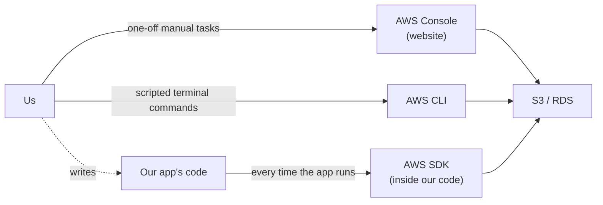
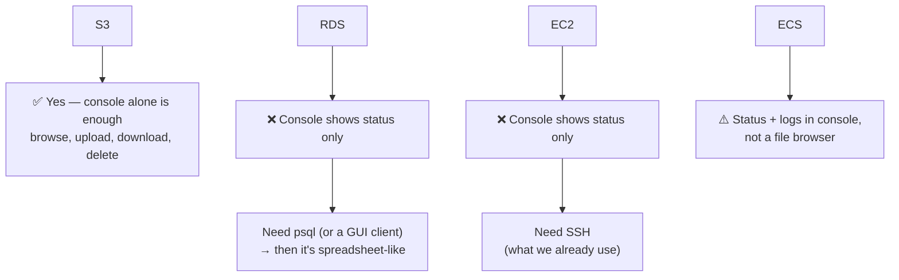
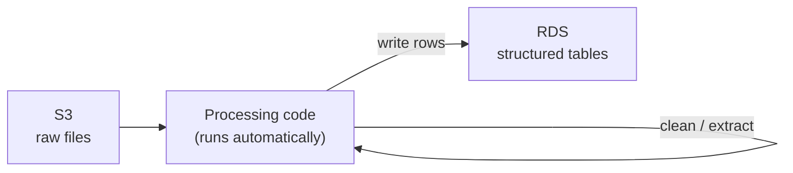
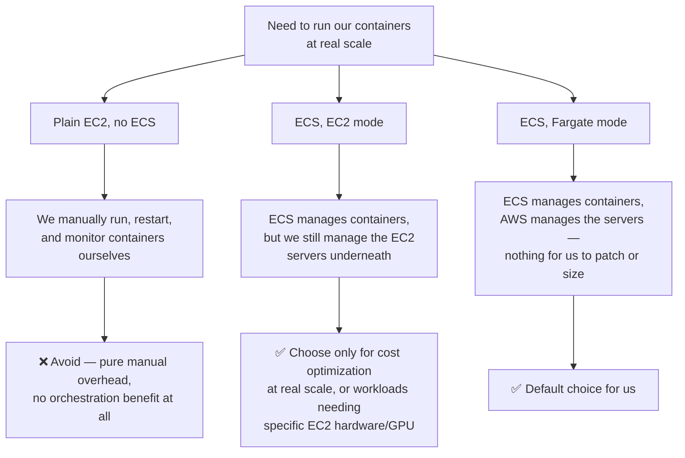
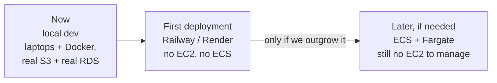

# AWS setup — S3, RDS, EC2, ECS, explained simply

Companion to the main architecture doc — covers how AWS access actually works, and what our setup path looks like. Doesn't repeat the "what we're building and why."

---

## AWS is a toolbox, not one thing

Four separate, independent services — none require the others to already exist:

- **S3** — file storage
- **RDS** — a managed database
- **EC2** — a virtual server you manage yourself
- **ECS** — manages containers for you; can run them on EC2, or on AWS's own infrastructure (Fargate)

---

## Getting access: IAM, not a handover

Someone owns the AWS account (likely the manager) and creates an **IAM user** for us — a restricted login scoped to specific permissions (create S3 buckets, create databases), without full account control.

**The ask to the manager:** an IAM user with permission to manage S3/RDS (and later EC2/ECS) — not for him to build things and hand them over. We'd need that access ourselves eventually anyway, so it's simpler to start with it.

---

## How we actually interact with each service

Three interfaces, each for a different kind of task:

| Interface | What it's for | Example |
|---|---|---|
| **Console** (website) | Occasional manual look/upload | Uploading a batch of PDFs, checking a file landed in S3 |
| **CLI** (terminal) | Scripted one-off tasks | `aws s3 sync` to upload a whole folder |
| **SDK** (in our code) | How the running app actually uses these services | App fetching a PDF, reading/writing DB rows — no browser or terminal involved |

**RDS specifically** runs plain PostgreSQL — the industry-standard choice, and what we're using here. We connect to it with **`psql`** for querying — same tool used against any Postgres database, just pointed at the RDS address instead of `localhost`.

### Does it feel like a file explorer?

Only S3 is a true file explorer, because it only holds files — nothing else to represent. RDS, EC2, and ECS each manage something more complex, so their consoles show status/controls, and we reach for a separate tool to actually look inside.

*(Minor S3 nuance: folders aren't real — a file's full path is just its name, and the console fakes folder-nesting from the `/` characters for convenience. An "empty folder" only appears once a file exists under that path.)*

---

## S3 — file storage

Holds raw API dumps (pre-cleaning) and PDFs (kept long-term now, not deleted after use). This doesn't change as more APIs get added (hotels, etc., on top of the current sightseeing data) — S3 scales to whatever volume we throw at it without needing different setup, whether that's 32GB from one API or several times that across many.

**Storing and browsing PDFs and raw API data on S3 is both easy and the correct choice.**

- **Storing** is just an upload — no schema or conversion needed, raw JSON and PDFs go in as-is
- **Browsing** is a genuine file-explorer experience in the console — folders, file names, sizes, last-modified dates, all clickable, no code required
- **Working with it programmatically** is just as simple — our code fetches any file instantly by its exact path, since RDS keeps a reference to exactly which S3 key holds which file, so no scanning or searching is needed

*(The one caveat already noted above: folders aren't literally real, just inferred from file paths — invisible in practice.)*

**For local development:** connect directly to the real bucket using dev AWS credentials — no local fake copy needed, since S3 is accessed over the internet the same way whether the code runs on a laptop or a server. *(MinIO can simulate S3 locally, but with real data already in a real bucket, it adds a second thing to maintain for no benefit right now.)*

---

## RDS — the database

S3 holds raw files; RDS holds **structured, queryable data** — actual rows our app filters and searches (e.g., "hotels in Rome under ₹5000"). Raw files don't become rows automatically — they go through processing first.

**One RDS instance can hold multiple databases.** RDS is really a managed Postgres *server*, and one server can host several separate databases, each with its own tables and users.

- So we're not limited to one database per instance — e.g. separate databases per environment (dev/staging/prod) are possible on a single instance
- The tradeoff: multiple databases on one instance still share the same underlying compute/RAM/storage, so it organizes data logically but doesn't add performance headroom the way a second instance would

For us, structured data and the pgvector RAG data are meant to be queried together — so we'll use **one database** with multiple tables/schemas inside it, rather than splitting across databases.

This is a repeatable pipeline (code we write once), not a manual one-time copy.

**Same database also powers the RAG layer.** RDS being plain Postgres is exactly why this works cleanly — Postgres has an extension called **pgvector** that adds vector/semantic search directly inside the same database.

So the RAG (chatbot/recommendation) layer queries the same RDS instance as everything else, not a separate system. No extra database to stand up, no data duplication, and no risk of the chatbot's data drifting out of sync with the live catalog — it's reading the same rows, just through a different kind of query (similarity search instead of exact filters).

**Local database, or RDS — which one should the database itself actually be?**

Worth separating from the "local dev setup" question above — this is about where the database *lives*, not just how we connect to it.

The raw data from a single API (sightseeing) is already ~32GB, and more APIs are coming (hotels, etc.) — so this isn't a small, one-person dataset. Cleaning shrinks it down, but the vector/RAG layer on top tends to end up *larger* than the cleaned data, not smaller. Across multiple APIs, the structured+vector footprint adds up to a real, team-shared amount of data fairly quickly.

A database running locally on one person's laptop doesn't hold up well at that scale, for a team:
- It only exists on one machine — if that person's offline or their disk fills up, everyone's blocked
- Five people can't reliably all query and write to "someone's laptop" as a shared source of truth
- We'd be developing against a different engine locally than what we deploy on (RDS) anyway, gaining nothing but avoiding a monthly bill

**RDS solves this directly** — one shared, always-reachable database that both local dev and production point at. That's exactly the "connect directly to the real RDS database" setup described below.

The only case where a local DB would make more sense is solo, throwaway prototyping — not a 5-person team building toward a real deployment with a growing, multi-API dataset.

**For local development day to day:** connect directly to the real RDS database using credentials, rather than running a separate local Postgres. Simple while the team's small. *(Worth revisiting only once risky experiments threaten to mess up real data — then each person might get their own local copy.)*

**Putting S3 + RDS together, day to day:**
1. Someone with IAM permissions creates the bucket and the database, once
2. Credentials go into a config file — never hardcoded, never committed to the repo
3. Each developer drops those same credentials into their own local config
4. Local code then talks directly to the real S3 bucket and real RDS database — identical to production, nothing to sync

This works because the code never hardcodes *where* things are — that always comes from config, which differs between local and production while the code itself stays the same.

---

## EC2 — a server you manage yourself

Just a virtual machine — you install software, run programs, restart things on crash, patch the OS. It knows nothing about containers or Docker on its own.

**We don't need it right now** — local dev runs on our own laptops, and there's a simpler path for first deployment (below).

---

## Compute: EC2, ECS+EC2, ECS+Fargate — when each applies

Three real options once we're past Railway/Render, not one. Worth being clear about all three so we don't default into the wrong one later.

| Option | When it's the right call | When to avoid it |
|---|---|---|
| **Plain EC2, no ECS** | Never really, for us — maybe a single always-on background task too small to justify any orchestration at all | Avoid whenever we have more than one service to run (we already have several: core-api, quote-engine, rag-service) — we'd be manually doing the restart/monitor/scale work ECS exists to automate, for no benefit |
| **ECS, EC2 mode** | Once we're at a scale where we're optimizing AWS cost closely and can get cheaper pricing by managing our own reserved/spot EC2 capacity, or if a workload needs specific hardware (e.g. GPU instances) that Fargate doesn't offer | Avoid at our current size — the cost savings only show up at meaningfully large, steady scale, and until then it just adds server-patching and capacity-planning work with no payoff |
| **ECS, Fargate mode** | Our default once we outgrow Railway/Render — get everything ECS offers (auto-restart, scaling, health checks) with zero server management | The only downside is it's typically a bit pricier per unit of compute than self-managed EC2 — acceptable tradeoff for us since we're optimizing for less operational overhead, not squeezing out the lowest possible AWS bill |

**Bottom line for us:** start on Railway/Render, move to ECS+Fargate if/when we outgrow it, and only consider ECS+EC2 mode later if cost optimization becomes a real, specific priority at real scale. Plain EC2 with no ECS isn't worth it at any point once we have multiple services running.

---

## Our actual path

Plain EC2 with no ECS isn't something we're likely to need at any point once we have multiple services running (see the compute decision table above) — it's manual overhead ECS exists to remove.

**The one thing worth doing now, because it's free:** keep each service as its own Docker container (core-api, quote-engine, rag-service) — already the plan. That alone means adopting ECS later is just pointing it at the same containers, not a redesign.

---

## Alternatives considered, and why we should stay on AWS

Worth recording so this isn't re-debated later.

| Provider | Storage equivalent | Database equivalent | Compute equivalent | Where it stands out |
|---|---|---|---|---|
| **AWS** (chosen) | S3 | RDS | EC2 / ECS / Fargate | Largest ecosystem, most mature — but not always the cheapest |
| **Google Cloud** | Cloud Storage | Cloud SQL | Compute Engine / Cloud Run | Cloud Run is simpler than ECS+Fargate; strong if leaning on Google's AI/ML tooling later |
| **Microsoft Azure** | Blob Storage | Azure Database for PostgreSQL | VMs / Container Apps | Matters mainly with existing Microsoft/enterprise relationships |
| **Cloudflare R2 + Neon/Supabase** | R2 (S3-compatible, zero egress fees — "egress" being the cost charged for data leaving the storage, e.g. every time a file is downloaded or fetched) | Neon or Supabase (managed Postgres with pgvector) | Railway / Render / Fly.io | Cheaper on paper, but see note below — the egress saving matters less for us than it would for a typical storage-heavy app |
| **DigitalOcean** | Spaces (S3-compatible) | Managed PostgreSQL | Droplets / App Platform | Simpler console, simpler pricing |

*(Earlier framing assumed the app would be constantly fetching files back out of storage — e.g. serving PDFs directly on frequent requests — which is what made egress cost a bigger factor. That's not the current plan; see below.)*

The standout cost alternative on paper is **Cloudflare R2 + Neon/Supabase + Railway/Render** — R2's zero egress fees and Neon/Supabase's typically lower pgvector pricing than RDS.

But this matters less for us than the table suggests: **itinerary building and the RAG layer query RDS directly, not S3.** S3 only gets touched once, when raw data first lands during ingestion, and occasionally afterward if something needs the original PDF specifically (e.g. citation lookups) — not on every itinerary or recommendation request. So we're not "constantly fetching files back out" of S3 the way a typical storage-heavy app would be, and the egress saving R2 offers doesn't apply to most of our traffic.

If AWS costs become a real pain point later, egress still wouldn't be the place to look first for us, given the usage pattern above — cost optimization would more likely come from the RDS/compute side (per the ECS+Fargate vs EC2 mode discussion earlier) than from switching storage providers.

**The practical case for staying on AWS: the company already runs infrastructure there.**

- **One account, one IAM system, one security boundary** — permissions, networking, and access control only need to be reasoned about once, in one place, instead of duplicated across two providers' systems
- **Existing account structure and billing already in place** — whatever setup and conventions the company has already built on AWS apply directly to this project too, at zero extra setup cost
- **Everything sits under one bill, one support relationship, one place to monitor spend** — rather than splitting operational overhead and cost visibility across multiple vendors for a saving that only matters at a scale we're not at yet
