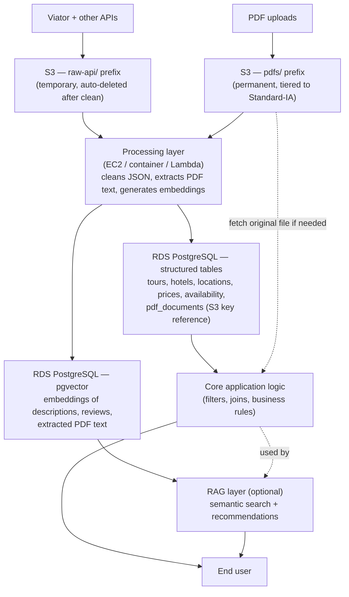

# Travel data platform — architecture

## Notes

- **S3** is object storage only — no schema, no queries beyond metadata. Two prefixes serve two different lifecycles: raw API data is transient, PDFs are permanent.
- **Processing layer** is not a managed data store — it's your own code, wherever it runs (EC2/container/Lambda), reading from S3 and writing into RDS.
- **RDS PostgreSQL** holds both structured tables and the pgvector index, in the same instance — one database, two access patterns.
- **Core application logic** is the primary consumer of structured data (direct SQL queries/filters). **RAG is a secondary, optional layer** on top of the same database — it does not replace or gate the core logic.
